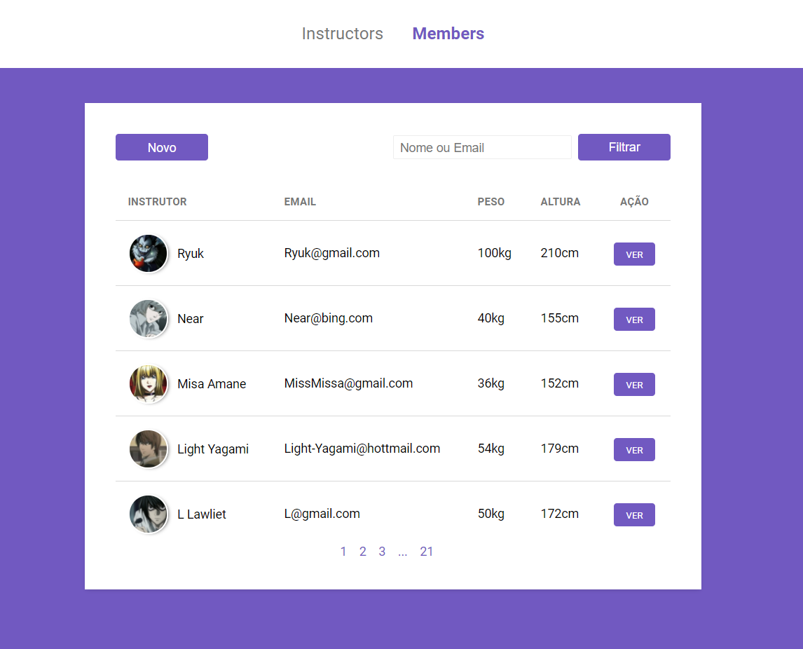
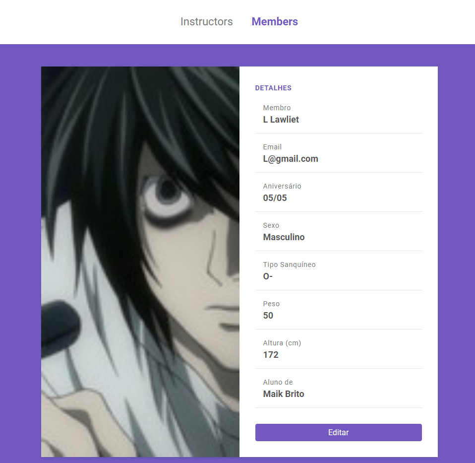

<h1 align="center">
    
</h1>

<p align="center">
  <a href="#-tecnologias">Tecnologias</a>&nbsp;&nbsp;&nbsp;|&nbsp;&nbsp;&nbsp;
  <a href="#-projeto">Projeto</a>&nbsp;&nbsp;&nbsp;|&nbsp;&nbsp;&nbsp;
  <a href="#-layout">Layout</a>&nbsp;&nbsp;&nbsp;|&nbsp;&nbsp;&nbsp;
</p>

<br>

## 🚀 Tecnologias

Esse projeto foi desenvolvido com as seguintes tecnologias:

- [Node.js](https://nodejs.org/en/)
- HTML5
- CSS3
- [Express](https://expressjs.com/pt-br/)
- [PostgreSQL](https://www.postgresql.org/)
- [Nunjunks](https://mozilla.github.io/nunjucks/)

## 💻 Projeto

Aplicação para gerenciamento de academia, a aplicação consiste em criar instrutores e membros de uma academia, assim como editar seus dados e poder excluí-los, cada instrutor ou membro vai para a parte inicial, onde ficam em ordem alfabetica e são distribuidos por paginas, e pode-se pesquisa-los por meio de uma barra que filtra por nome ou e-mail.

## 🔖 Layout

<h1 align="center">
    
    
    
    
    
    
</h1>

### Para executar o projeto

```
npm install
```

```
npm start
```
